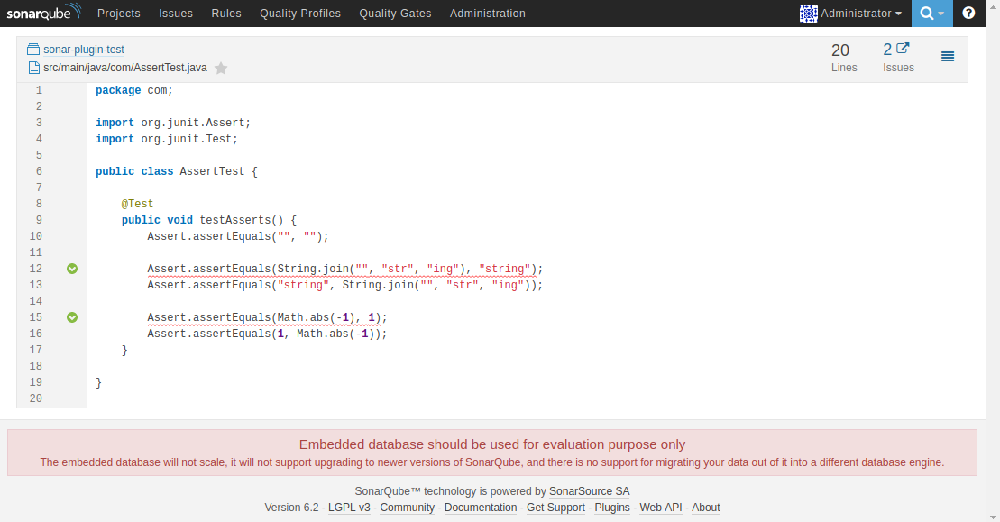

## Assert.assertEquals parameter order check
This rule detects the incorrect usage of Assert.assertEquals. The first parameter of this method is the expected
    value and the second parameter is the calculated value.

## Usage:
* Build and install
  * Use the official plugin installation guide: [Writing Custom Java Rules 101](http://docs.sonarqube.org/display/PLUG/Writing+Custom+Java+Rules+101)
* It requires to install the **Java Plugin** **4.2.1** on your SonarQube 5.6+

## Example:

Result on the example project:

